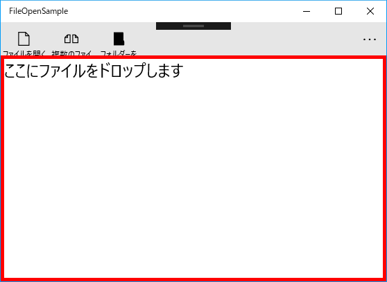

# ファイルやフォルダーを開くサンプル

ダイアログで選択されたファイルやフォルダーとウィンドウにドロップされたファイルやフォルダーのパスを表示するUWPアプリケーションです。

## ファイルを開くダイアログ

FileOpenPickerを使ってファイルを開くダイアログを表示し、選択されたファイルのパスを表示します。

ファイルを一つ選択するときは、FileOpenPickerクラスのPickSingleFileAsync()メソッドを使用します。

    /// 

    /// ファイルを開く
    /// 

    private async void ButtonOpenFile_Click(object sender, RoutedEventArgs e)
    {
        var filePicker = new Windows.Storage.Pickers.FileOpenPicker
        {
            ViewMode = Windows.Storage.Pickers.PickerViewMode.List,
            // 初期フォルダー
            SuggestedStartLocation = Windows.Storage.Pickers.PickerLocationId.Desktop,
            // 開くボタンのラベルのテキスト
            CommitButtonText = "このファイルを開く",
            // すべてのファイルを選択可能
            FileTypeFilter = { "*" },
            // 選択可能なファイルの拡張子を指定する
            //FileTypeFilter = { ".txt", ".xlsx", },
        };
        // 選択されたファイルを取得する
        var file = await filePicker.PickSingleFileAsync();
        if (file != null)
        {
            ListView.ItemsSource = new[] { GetFileName(file) };
        }
    }

## ファイルを開くダイアログ(複数のファイルを開く)

ファイルを複数選択するときは、FileOpenPickerクラスのPickMultipleFilesAsync()メソッドを使用します。

    /// 

    /// 複数のファイルを開く
    /// 

    private async void ButtonOpenFile_Click(object sender, RoutedEventArgs e)
    {
        var filePicker = new Windows.Storage.Pickers.FileOpenPicker
        {
            ViewMode = Windows.Storage.Pickers.PickerViewMode.Thumbnail,
            // 初期フォルダー
            SuggestedStartLocation = Windows.Storage.Pickers.PickerLocationId.Desktop,
            // 開くボタンのラベルのテキスト
            CommitButtonText = "このファイルを開く",
            // すべてのファイルを選択可能
            FileTypeFilter = { "*" },
            // 選択可能なファイルの拡張子を指定する
            //FileTypeFilter = { ".txt", ".xlsx", },
        };

        // 選択されたファイルを取得する(複数選択)
        var files = await filePicker.PickMultipleFilesAsync();

        // 選択されたファイルのパスをリストビューに表示する
        ListView.ItemsSource = files.Select(file => GetFileName(file));
    }

## フォルダーを開くダイアログ

FolderPickerを使ってフォルダーを開くダイアログを表示し、選択されたフォルダーとフォルダー内のファイルのパスを表示します。

    /// 

    /// フォルダーを開く
    /// 

    private async void ButtonOpenFolder_Click(object sender, RoutedEventArgs e)
    {
        var folderPicker = new Windows.Storage.Pickers.FolderPicker
        {
            // フォルダーの選択ボタンのラベルのテキスト
            CommitButtonText = "このフォルダーを選択する",
            // 初期フォルダー
            SuggestedStartLocation = Windows.Storage.Pickers.PickerLocationId.Desktop
        };
        // すべてのファイル
        folderPicker.FileTypeFilter.Add("*");

        StorageFolder folder = await folderPicker.PickSingleFolderAsync();
        if (folder == null)
            return;

        // フォルダー内コンテンツの読み書きのアクセス権を追加する
        Windows.Storage.AccessCache.StorageApplicationPermissions.FutureAccessList.AddOrReplace("PickedFolderToken", folder);

        // 選択されたファイルのパスをリストビューに表示する
        ListView.ItemsSource = await GetFileNmaeInFolderAsync(folder);
    }

## ドラッグアンドドロップ

ドロップ領域内にマウスポインタが入ったとき、マウスカーソルを変更します。

    private void Border_DragOver(object sender, DragEventArgs e)
    {
        // コピーのアイコンに切り替える
        e.AcceptedOperation = DataPackageOperation.Copy;
    }

ウィンドウ上にファイルやフォルダーをドラッグアンドドロップすると、ドロップされたファイルのパスを表示します。

フォルダーがドロップされた場合は、フォルダー内のファイルのパスも表示します。

    private async void Border_Drop(object sender, DragEventArgs e)
    {
        // ファイルの場合
        if (e.DataView.Contains(StandardDataFormats.StorageItems))
        {
            // ドロップされた項目を取得する
            var items = await e.DataView.GetStorageItemsAsync();

            // ファイルのパスをリストビューに表示する
            var list = new List<string>();
            foreach (var item in items)
            {
                if (item is StorageFolder)
                {
                    // フォルダーのとき
                    list.AddRange(await GetFileNmaeInFolderAsync(item as StorageFolder));
                }
                else
                {
                    // ファイルのとき
                    list.Add(GetFileName(item));
                }
            }
            ListView.ItemsSource = list;
        }
    }

## ファイル名・フォルダー名を取得する

ファイル名やフォルダー名を取得するコードは次のようになっています。

    /// 

    /// リストビューに表示するファイル名を取得する
    /// 

    private string GetFileName(IStorageItem file)
    {
        return $"File: {file.Path}";
    }

    /// 

    /// リストビューに表示するフォルダー名とフォルダー内ファイル名を取得する
    /// 

    private async Task<IEnumerable<string>> GetFileNmaeInFolderAsync(StorageFolder folder)
    {
        var result = new List<string>();
        result.Add($"Folder: {folder.Path} {folder.Name}");

        var files = await folder.GetFilesAsync();
        result.AddRange(files.Select(x => $">> {x.Path}").ToArray());

        return result.ToArray();
    }
