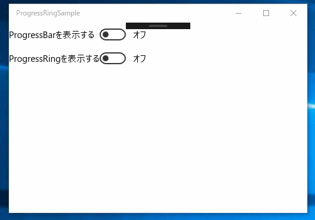

# UWPのProgressRingとProgressBarのサンプルです。

## ProgressBar

    <ProgressBar
        Grid.Row="1"
        Grid.ColumnSpan="2"
        HorizontalAlignment="Stretch"
        IsIndeterminate="True"
        Visibility="{x:Bind bar.IsOn, Converter={StaticResource booleanToVisibility}, Mode=OneWay}" />

## ProgressRing

        <ProgressRing
            Grid.Row="3"
            Grid.ColumnSpan="2"
            IsActive="{x:Bind ring.IsOn, Mode=OneWay}" />
