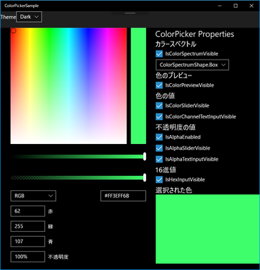

# UWP-Sample

UWP(C#)のサンプルです。

## [ColorPickerのサンプル](ColorPickerSample/)

ColorPickerのサンプルアプリケーションです。

ColorPickerのプロパティを変更したときの、表示状態を確認できます。  
テーマ（ライトテーマ・ダークテーマ）を切り替えることができ、テーマごとのColorPickerの表示も確認できます。

## [DataTemplateSelectorでDataTemplateを切り替える](DataTemplateSelectorSample/)

ListViewのDataTemplateをデータの内容によって切り替える方法です。

## [ファイルやフォルダーを開くサンプル](FileOpenSample/)

ダイアログで選択されたファイルやフォルダーとウィンドウにドロップされたファイルやフォルダーのパスを表示するUWPアプリケーションです。

## [ListViewのグループ化のサンプル](ListViewGrouping/)

ListViewでデータをグループ化して表示するUWPアプリケーションです。

## [コンテキストメニューを表示するサンプル](ContextMenuSample/)

ボタンを右クリックしたときにコンテキストメニューを表示するサンプルです。

ボタンを右クリックすると、コンテキストメニューを表示します。  
コンテキストメニューからメニュー項目を選択すると、選択された項目を表示します。

## [ハンバーガーメニューのサンプル](HamburgerMenu/)

ハンバーガーメニューのサンプルアプリです。

## [UWPのProgressRingとProgressBarのサンプルです。](ProgressRingSample/)

## [テーマ(ライトテーマorダークテーマ)を取得・設定するサンプル](ThemeSample/)

アプリの実行中にStackPanelのテーマを変更するサンプルアプリケーションです。

