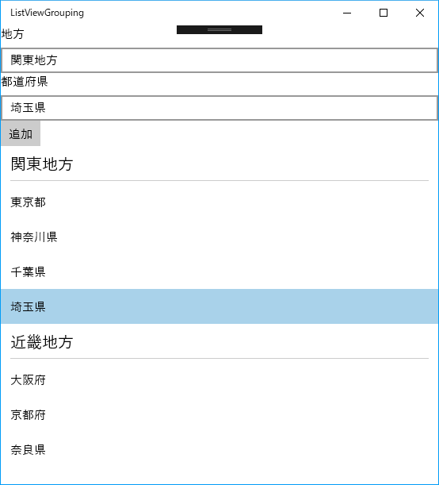

# UWP-Sample

UWP(C#)のサンプルです。

## [ファイルやフォルダーを開くサンプル](FileOpenSample/)

ダイアログで選択されたファイルやフォルダーとウィンドウにドロップされたファイルやフォルダーのパスを表示するUWPアプリケーションです。

## [ListViewのグループ化のサンプル](ListViewGrouping/)

ListViewでデータをグループ化して表示するUWPアプリケーションです。

## [コンテキストメニューを表示するサンプル](ContextMenuSample/)

ボタンを右クリックしたときにコンテキストメニューを表示するサンプルです。

ボタンを右クリックすると、コンテキストメニューを表示します。  
コンテキストメニューからメニュー項目を選択すると、選択された項目を表示します。

## [ハンバーガーメニューのサンプル](HamburgerMenu/)

ハンバーガーメニューのサンプルアプリです。

