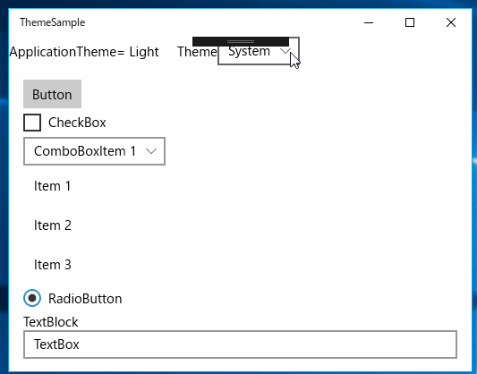

## テーマ(ライトテーマorダークテーマ)を取得・設定するサンプルアプリケーション

アプリの実行中にStackPanelのテーマを変更するサンプルアプリケーションです。

## 適用されているテーマを取得する

### アプリのテーマを取得する

アプリのテーマを取得するには、ApplicationクラスのRequestedThemeプロパティを使用します。

    ApplicationTheme appTheme = Application.Current.RequestedTheme;

ApplicationTheme型は次のように宣言されています。

    public enum ApplicationTheme
    {
        Light = 0,
        Dark = 1
    }

アプリのテーマがライトテーマのときは「Lright」、ダークテーマのときは「Dark」になります。

### コントロールのテーマを取得する

コントロールのテーマを取得するには、FrameworkElementクラスのRequestedThemeプロパティを使用します。

    ElementTheme eleTheme = StackPanel.RequestedTheme;

ElementTheme型は次のように宣言されています。

    public enum ElementTheme
    {
        Default = 0,
        Light = 1,
        Dark = 2
    }

「Default」のときは、Application.RequestedThemeの値が使用されます。

## テーマを設定する

### アプリのテーマを設定する

アプリのテーマを設定するには、ApplicationクラスのRequestedThemeプロパティにテーマ(ApplicationTheme)の値を設定します。

    Application.Current.RequestedTheme = ApplicationTheme.Dark;

アプリのテーマは起動時にのみ設定できます。実行中は設定できません。

    sealed partial class App : Application
    {
        public App()
        {
            this.InitializeComponent();
            this.Suspending += OnSuspending;
            // ダークテーマに設定する
            Application.Current.RequestedTheme = ApplicationTheme.Dark;
        }

### コントロールのテーマを設定する

コントロールのテーマを取得するには、FrameworkElementクラスのRequestedThemeプロパティにテーマ(ElementTheme)の値を設定します。

コントロールのテーマは、アプリの実行中に設定できます。

    StackPanel.RequestedTheme = ElementTheme.Light;

